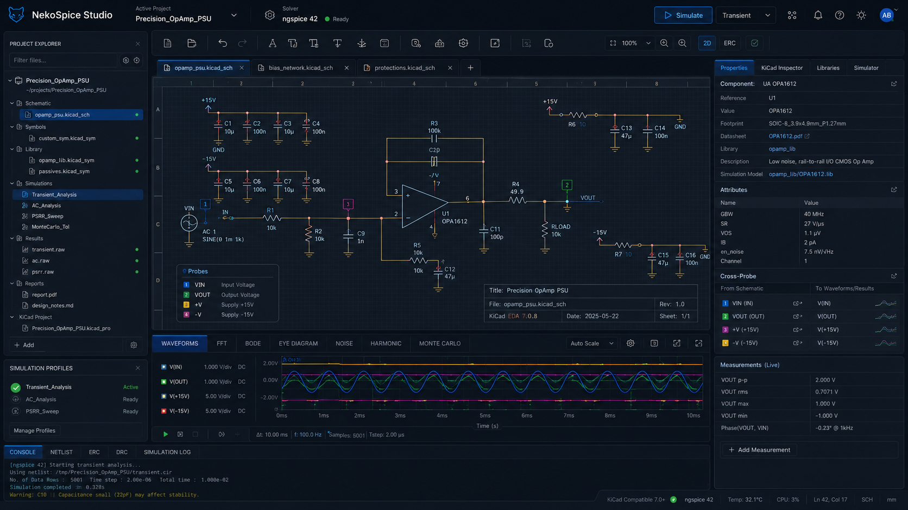
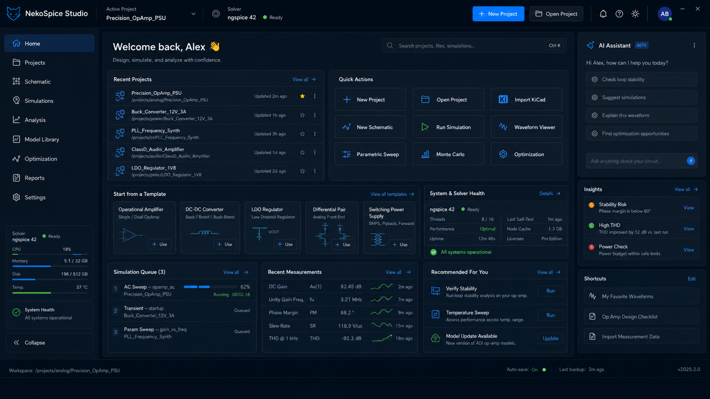
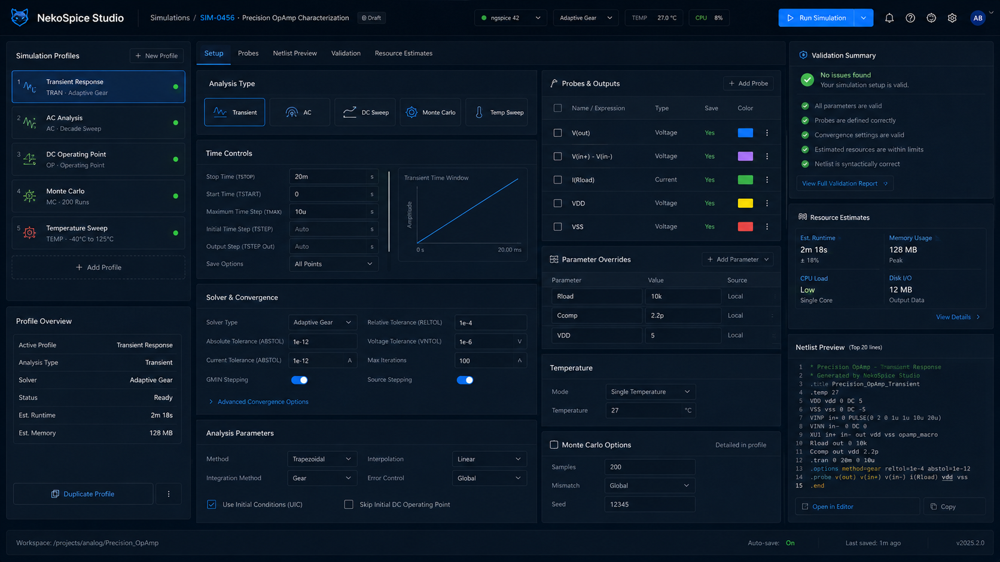
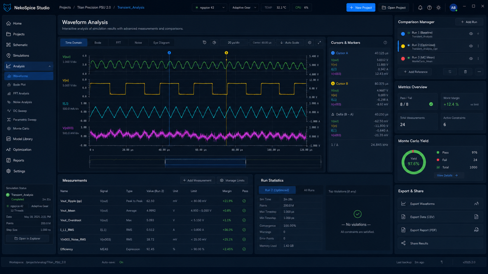
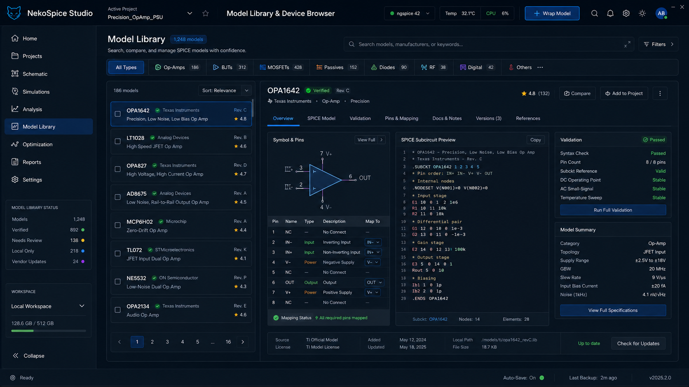
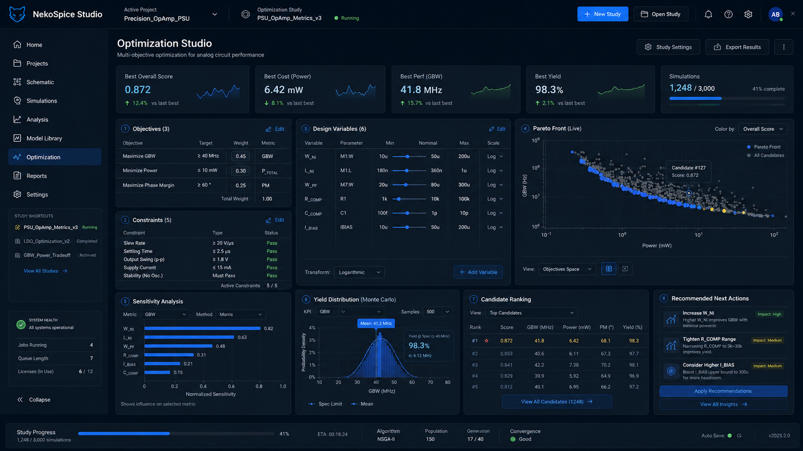
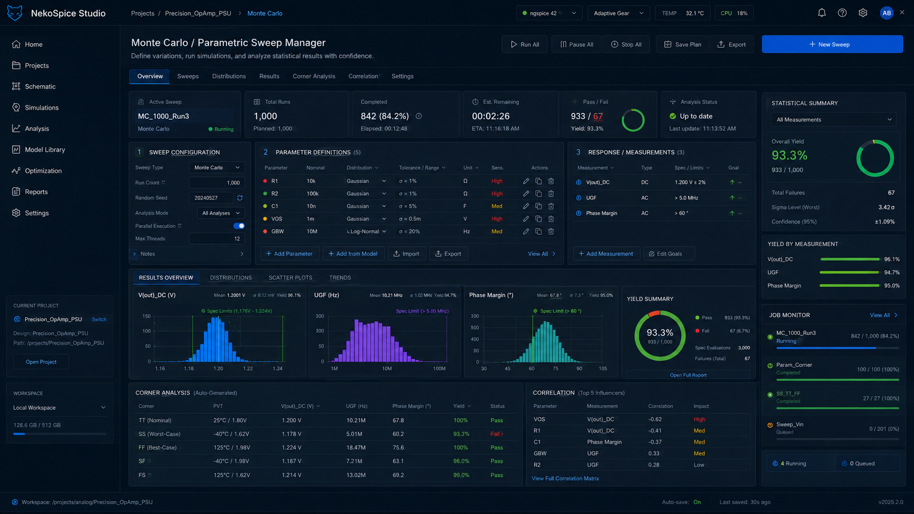
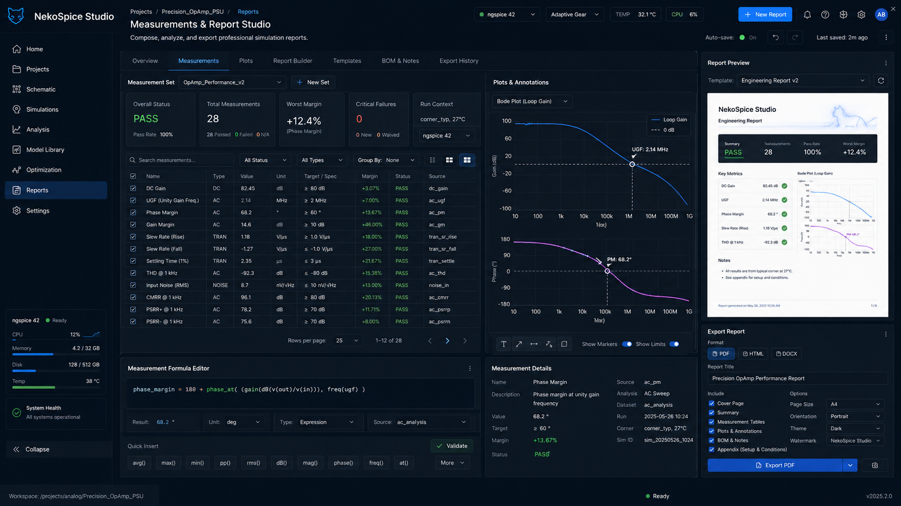
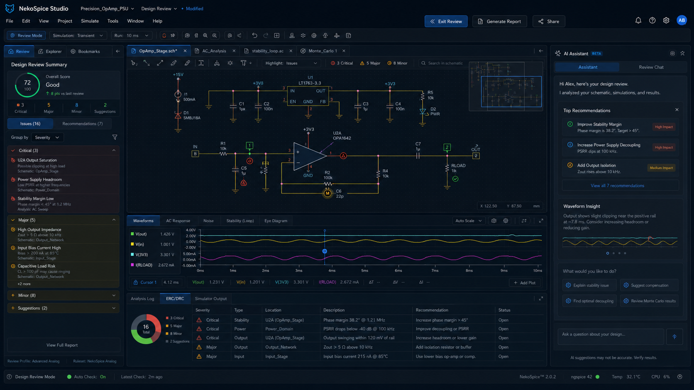
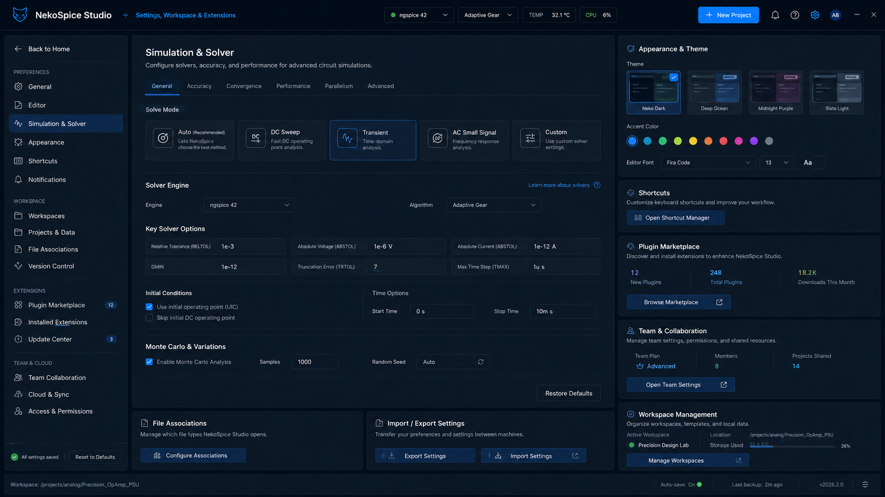

<div align="center">



# NekoSpice

### Rust 原生 SPICE 仿真平台

**高性能 · 原生原理图 · 双求解器 · 现代 GUI**

[](https://www.rust-lang.org/)
[](LICENSE)
[]()
[]()
[]()
[]()

[快速开始](#快速开始) · [界面预览](#界面预览) · [架构设计](#架构设计) · [仿真工作流](#仿真工作流) · [操作指南](#操作指南) · [开发指南](#开发指南)

</div>

---

## ✦ 项目简介

NekoSpice 是一款基于 Rust 原生构建的高性能 SPICE 仿真平台。它将原理图编辑、仿真配置、波形分析和报告生成整合在一个现代化的 GUI 界面中，为电路设计工程师提供从设计到验证的完整工作流。

**核心理念：**

- **Rust 原生** — 全栈 Rust 实现，零 GC、零运行时开销
- **双求解器** — 内置 ngspice 和 Xyce，一键切换，满足不同仿真需求
- **硬件加速** — egui + wgpu 渲染引擎，支持 Wayland/Native GPU 加速
- **格式兼容** — 支持标准 S-expression 原理图格式，兼容主流 EDA 工具链

---

## ✦ 核心特性

<table>
<tr>
<td width="50%">

### 🎨 原生原理图引擎
Rust 重写的 S-expression 原理图解析引擎，支持完整的原理图编辑工作流：放置元件、绘制导线、标签管理、ERC 检查、层次化设计。

### ⚡ 双求解器后端
内置 **ngspice** 和 **Xyce** 双求解器，支持瞬态分析、交流分析、直流扫描、噪声分析、失真分析等多种分析类型。10 种求解器预设覆盖从高频射频到低功耗 IoT 的各类场景。

### 📊 高性能波形分析
支持百万点波形的实时缩放、叠加分析。提供时域、FFT（Hanning 窗）、Bode 图、噪声频谱、眼图等 5 种分析模式。

</td>
<td width="50%">

### 🏭 厂商模型库
内置 Texas Instruments (TI) 和 Analog Devices (ADI) SPICE 模型库，自动注入子电路，支持 `.lib` / `.mod` / `.sub` / `.sp` / `.cir` 格式。

### 📋 工程报告
支持 HTML、JSON、Markdown、JUnit 四种导出格式，内置 ERC 评分、风险评级、优化建议，支持 CI/CD 集成。

### 🌐 中英文国际化
完整的 i18n 国际化支持，一键切换中文/English，所有界面文本均可本地化。

### 🎯 参数优化
蒙特卡洛分析、参数扫描、优化目标设定，支持分布预览和统计摘要。

</td>
</tr>
</table>

---

## ✦ 界面预览

NekoSpice 提供 9 个工作区，覆盖完整的电路设计与仿真工作流：

### 🏠 首页仪表板

项目入口，提供快捷操作、模板选择和最近项目列表。

<div align="center">

</div>

---

### 🎨 原理图编辑器

核心编辑界面，支持放置元件、绘制导线、标签管理，底部提供波形、FFT、Bode、控制台、网表、ERC、属性检查器 7 个标签页。

<div align="center">

</div>

---

### 📚 符号库浏览

浏览和管理原理图符号库，支持 TI/ADI 厂商模型面板，拖放放置元件。

<div align="center">

</div>

---

### ⚙️ 仿真配置

配置分析类型、求解器预设、步进扫描、厂商模型注入，一键运行仿真。

<div align="center">

</div>

---

### 🎯 参数优化

蒙特卡洛分析、参数扫描设置，支持分布预览和统计摘要。

<div align="center">

</div>

---

### 🔍 设计审查

ERC 评分、风险评级、优先级排序和优化建议。

<div align="center">

</div>

---

### 📈 波形分析

时域、FFT、Bode、噪声、眼图 5 种分析模式，支持光标测量和多信号叠加。

<div align="center">

</div>

---

### 📄 报告生成

仿真报告列表和多格式导出（HTML/CSV/Markdown）。

<div align="center">

</div>

---

### ⚙️ 应用设置

主题切换（Dark/Light/Midnight）、语言设置、求解器路径配置。

<div align="center">

</div>

---

### 🔬 原理图详情

CM5 最小系统板示例原理图的详细视图。

<div align="center">

</div>

---

## ✦ 架构设计

### 系统分层

```
┌─────────────────────────────────────────────────────────────┐
│              NekoSpice GUI (egui + wgpu 硬件加速)             │
│              NekoSpice CLI (命令行批处理工具)                  │
├──────┬──────┬──────┬──────┬──────┬──────┬──────┬────────────┤
│ 首页 │原理图│ 库  │ 仿真 │优化  │ 审查 │波形  │ 报告        │
├──────┴──────┴──────┴──────┴──────┴──────┴──────┴────────────┤
│            nsp-schema — 原生原理图引擎 (Rust)                 │
│       S-expression 解析 · 编辑 · 连接图 · 网表导出            │
├─────────────────────────────────────────────────────────────┤
│            nsp-sim — 仿真后端                                  │
│         ngspice / Xyce 双求解器 · 配置注入                    │
├──────────┬──────────┬──────────┬────────────────────────────┤
│nsp-wave  │nsp-render│nsp-report│nsp-model                    │
│波形解析  │SVG 渲染   │报告生成  │TI/ADI 厂商模型             │
└──────────┴──────────┴──────────┴────────────────────────────┘
```

### Workspace 模块

| 模块 | 说明 | 行数 |
|------|------|------|
| `nsp-core` | 核心数据类型、错误处理、运行元数据 | 基础层 |
| `nsp-schema` | 原理图格式解析器 (S-expression)、IR、画布场景、ERC | 核心引擎 |
| `nsp-sim` | 仿真后端 trait、ngspice/Xyce CLI 配置注入 | 仿真核心 |
| `nsp-waveform` | Raw/CSV 波形解析、FFT、Bode、噪声分析 | 数据分析 |
| `nsp-netlist` | 网表解析、格式转换、兼容性检查 | 格式桥接 |
| `nsp-render` | SVG 原理图渲染引擎 | 渲染层 |
| `nsp-report` | HTML/JSON/Markdown/JUnit 报告生成 | 输出层 |
| `nsp-model` | TI/ADI 厂商 SPICE 模型管理 | 模型库 |
| `nsp-cli` | 命令行工具 (批处理操作) | CLI 工具 |
| `nsp-app` | GUI 应用 (9 个工作区, egui + wgpu) | 应用层 |

### 依赖关系图

```
                    ┌──────────┐
                    │nsp-core  │
                    └────┬─────┘
          ┌──────────────┼──────────────┐
          │              │              │
    ┌─────┴─────┐  ┌─────┴─────┐  ┌────┴─────┐
    │nsp-schema │  │nsp-sim    │  │nsp-netlist│
    └─────┬─────┘  └───────────┘  └──────────┘
          │
    ┌─────┴──────┬────────────┐
    │            │            │
┌───┴───┐  ┌────┴────┐  ┌───┴────┐
│nsp-   │  │nsp-     │  │nsp-    │
│render │  │waveform │  │report  │
└───┬───┘  └─────────┘  └────────┘
    │
    │  ┌──────────┐  ┌──────────┐
    ├──│nsp-model │  │nsp-cli   │
    │  └──────────┘  └──────────┘
    │
┌───┴──────────┐
│   nsp-app    │
│  (GUI 应用)  │
└──────────────┘
```

---

## ✦ 仿真工作流

### 标准仿真流程

```
┌─────────────┐     ┌─────────────┐     ┌──────────────┐
│  1. 原理图   │────▶│  2. 网表生成  │────▶│  3. 仿真配置  │
│  编辑/导入   │     │  (自动转换)  │     │  分析类型/参数 │
└─────────────┘     └─────────────┘     └──────┬───────┘
                                               │
┌─────────────┐     ┌─────────────┐     ┌──────┴───────┐
│  6. 报告    │◀────│  5. 结果分析  │◀────│  4. 求解器   │
│  导出/分享   │     │  波形/测量   │     │  ngspice/Xyce │
└─────────────┘     └─────────────┘     └──────────────┘
```

### 支持的分析类型

| 分析类型 | SPICE 指令 | 说明 | 典型应用 |
|---------|-----------|------|---------|
| 瞬态分析 | `.tran` | 时域波形仿真 | 开关响应、信号波形 |
| 交流分析 | `.ac` | 频率响应 | 滤波器、放大器 |
| 直流扫描 | `.dc` | 传输特性 | IV 曲线、增益特性 |
| 工作点 | `.op` | DC 偏置 | 静态工作条件 |
| 噪声分析 | `.noise` | 噪声频谱 | 低噪声放大器 |
| 失真分析 | `.disto` | 谐波失真 | 功率放大器 |
| 灵敏度 | `.sens` | 参数灵敏度 | 鲁棒性分析 |

### 10 种求解器预设

| 预设 | 适用场景 | 关键参数调整 |
|------|---------|-------------|
| **Default** | 通用电路 | 标准 SPICE 默认值 |
| **Fast** | 快速迭代 | 放松 RELTOL, VNTOL |
| **Accurate** | 高精度 | 严格容差, Gear 积分 |
| **High Frequency** | 射频/高频 | 优化 AC 分析步长 |
| **Convergence Aid** | 难收敛电路 | 激进迭代限值 |
| **Power Electronics** | 开关电源/电机 | 优化瞬态步长 |
| **Low Power** | IoT/电池电路 | 低电流精度优化 |
| **Precision** | 精密仪器 | 极低噪声/失调 |
| **Mixed Signal** | PLL/混合信号 | 数模混合优化 |
| **RF** | 射频/混频器 | 高频收敛优化 |

---

## ✦ 操作指南

### 全局快捷键

| 快捷键 | 操作 | 快捷键 | 操作 |
|--------|------|--------|------|
| `F5` | 运行仿真 | `Ctrl+S` | 保存 |
| `Ctrl+Z` | 撤销 | `Ctrl+Shift+Z` | 重做 |
| `Ctrl+C` | 复制 | `Ctrl+V` | 粘贴 |
| `Ctrl+X` | 剪切 | `Ctrl+O` | 打开文件 |
| `Ctrl+N` | 新建 | `Ctrl+Shift+S` | 另存为 |
| `Ctrl+1~9` | 切换工作区 | `Ctrl+Shift+E` | 导出网表 |
| `?` | 快捷键帮助 | | |

### 原理图工具

| 快捷键 | 工具 | 快捷键 | 工具 |
|--------|------|--------|------|
| `V` | 选择 | `W` | 绘制导线 |
| `L` | 添加标签 | `B` | 绘制总线 |
| `S` | 添加子图纸 | `J` | 添加节点 |
| `Q` | 无连接标记 | `R` | 旋转 (90°) |
| `F` | 适应视图 | `Del` | 删除选中项 |
| `Esc` | 取消 | `←↑↓→` | 微调位置 (2.54mm) |

### 鼠标操作

| 操作 | 功能 |
|------|------|
| 左键点击 | 选择/放置元件 |
| 右键拖拽 | 平移视图 |
| 滚轮 | 缩放视图 |
| 右键点击 | 打开上下文菜单 |

---

## ✦ 快速开始

### 环境要求

- **Rust** ≥ 2024 edition（通过 [rustup](https://rustup.rs/) 安装）
- **ngspice** — `sudo apt install ngspice`（Ubuntu/Debian）
- **Xyce**（可选）— 参考 [Xyce 官方文档](https://github.com/Xyce/Xyce)
- **Wayland 合成器** — GUI 应用需要 Wayland 环境

### 安装与构建

```bash
# 克隆仓库
git clone https://github.com/NekoRain404/NekoSpice.git
cd NekoSpice

# 构建 GUI 应用
cargo build -p nsp-app

# 运行 GUI
cargo run -p nsp-app

# 运行所有测试（215 项）
cargo test --workspace -- --skip placement

# 代码检查
cargo clippy --workspace --all-targets
cargo fmt --all
```

### 命令行使用

```bash
# 运行仿真
cargo run -p nsp-cli -- run examples/cm5_minima/CM5.nsp_sch

# 验证原理图
cargo run -p nsp-cli -- verify examples/schema_schematic/rc.nsp_sch

# 查看波形
cargo run -p nsp-cli -- waveform
```

### 配置文件

```
~/.config/nekospice/
├── settings.json              # UI 偏好 + 仿真选项
├── simulation_history.json    # 最近 20 次仿真记录
└── presets/                   # 用户自定义预设
    └── *.preset
```

---

## ✦ 项目结构

详细结构请参考 [TREE.md](docs/TREE.md)。

```
NekoSpice/
├── Cargo.toml              # Rust workspace 根配置
├── README.md               # 本文件
├── crates/                 # 10 个 workspace 模块
│   ├── nsp-core/           # 核心类型、错误处理
│   ├── nsp-schema/         # 原生原理图引擎 (S-expression)
│   ├── nsp-sim/            # 仿真后端 (ngspice/Xyce)
│   ├── nsp-waveform/       # 波形解析 (Raw/CSV/FFT)
│   ├── nsp-netlist/        # 网表解析与转换
│   ├── nsp-render/         # SVG 原理图渲染
│   ├── nsp-report/         # 报告生成 (HTML/JSON/MD/JUnit)
│   ├── nsp-model/          # TI/ADI 厂商模型管理
│   ├── nsp-cli/            # 命令行工具
│   └── nsp-app/            # GUI 应用 (egui + wgpu)
├── examples/               # 示例工程
│   ├── cm5_minima/         # CM5 最小系统板
│   ├── schema_schematic/   # RC 滤波器示例
│   ├── ltspice_import/     # LTspice 导入示例
│   └── ...                 # 更多示例
├── docs/                   # 文档与 UI 参考
│   ├── USER_MANUAL.md      # 用户手册
│   ├── TREE.md             # 项目结构说明
│   └── ui/                 # UI 参考图片
└── scripts/                # 工具脚本
    └── screenshot.sh       # 一键截图
```

---

## ✦ 设计原则

| 原则 | 说明 |
|------|------|
| **解耦** | 每个 workspace 模块职责单一，通过 trait 接口通信 |
| **文件管理** | 单文件不超过 300 行，超过则拆分为子模块 |
| **状态分离** | state.rs 定义状态，options.rs 定义参数 |
| **双后端** | ngspice + Xyce 通过统一 trait 抽象 |
| **格式兼容** | 兼容标准原理图 S-expression 格式读写 |
| **硬件加速** | egui + wgpu 渲染引擎，支持 Wayland |

---

## ✦ 测试状态

```bash
$ cargo test --workspace -- --skip placement
running 215 tests
...
test result: ok. 215 passed; 0 failed; 0 ignored
```

---

## ✦ 许可证

本项目采用双许可协议：

- **MIT License** — 详见 [LICENSE-MIT](LICENSE-MIT)
- **Apache License 2.0** — 详见 [LICENSE-APACHE](LICENSE-APACHE)

---

<div align="center">

**NekoSpice** — Rust 原生 SPICE 仿真平台

Built with ❤️ by NekoRain

</div>
